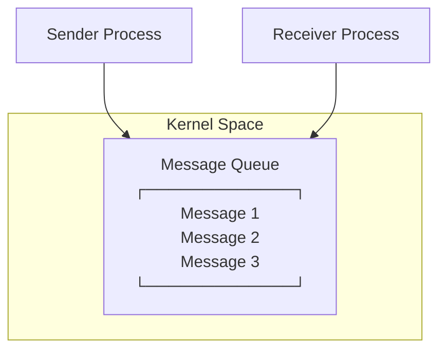
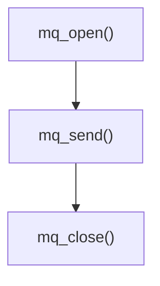
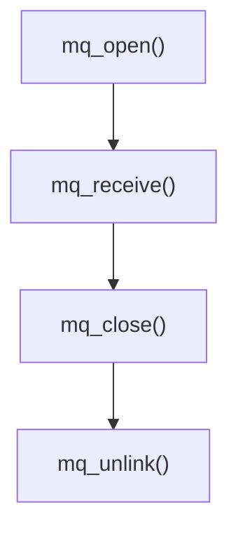
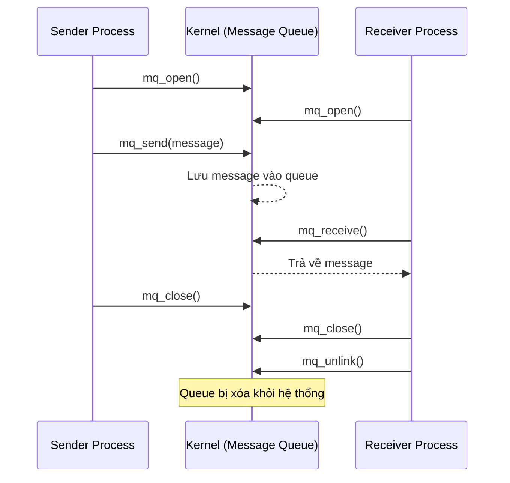

# POSIX Message Queue

POSIX Message Queue là cơ chế IPC (Inter-Process Communication) cho phép các process gửi dữ liệu cho nhau theo dạng **message**.

## Mô hình tổng quan

---

## Cơ chế hoạt động chung

Kernel tạo ra queue nằm trong **Kernel Space**. Message Queue thuộc về kernel và không thuộc về bất kỳ process nào — các process chỉ mở (`mq_open`) để truy cập vào cùng một queue.

> **Lưu ý:** Message Queue thuộc kernel và không thuộc bất kỳ process nào. Vòng đời của queue độc lập với vòng đời của process — queue vẫn tồn tại cho đến khi bị `mq_unlink()` hoặc hệ thống khởi động lại.

---

## Quy trình sử dụng

### Sender

### Receiver

### Toàn bộ tương tác giữa hai bên

---

## Thư viện cần dùng

| API | Header |
|---|---|
| `mq_open()` | `<mqueue.h>` |
| `mq_send()` | `<mqueue.h>` |
| `mq_receive()` | `<mqueue.h>` |
| `mq_close()` | `<mqueue.h>` |
| `mq_unlink()` | `<mqueue.h>` |
| `O_CREAT`, `O_RDWR` | `<fcntl.h>` |
| `perror()` | `<cstdio>` |
| `strlen()` | `<cstring>` |