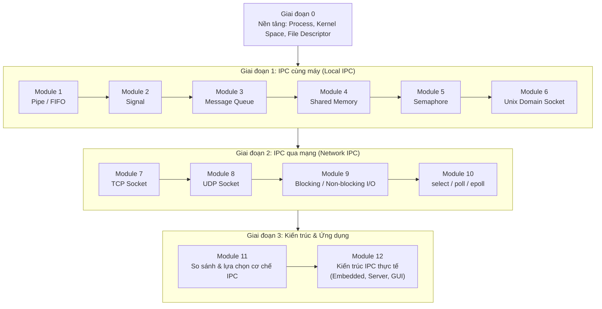
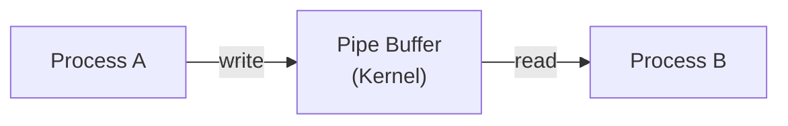
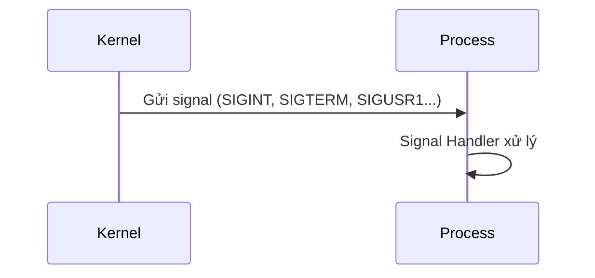
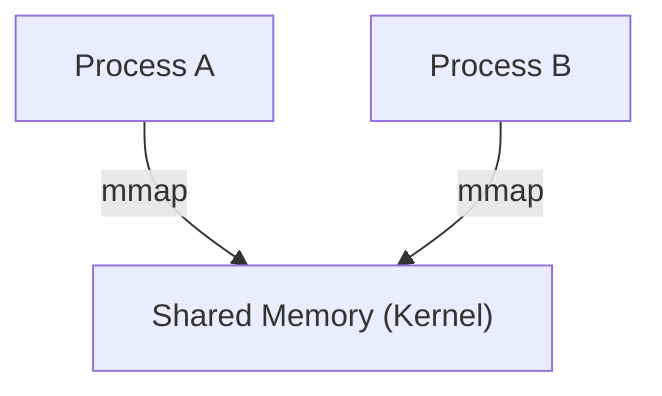
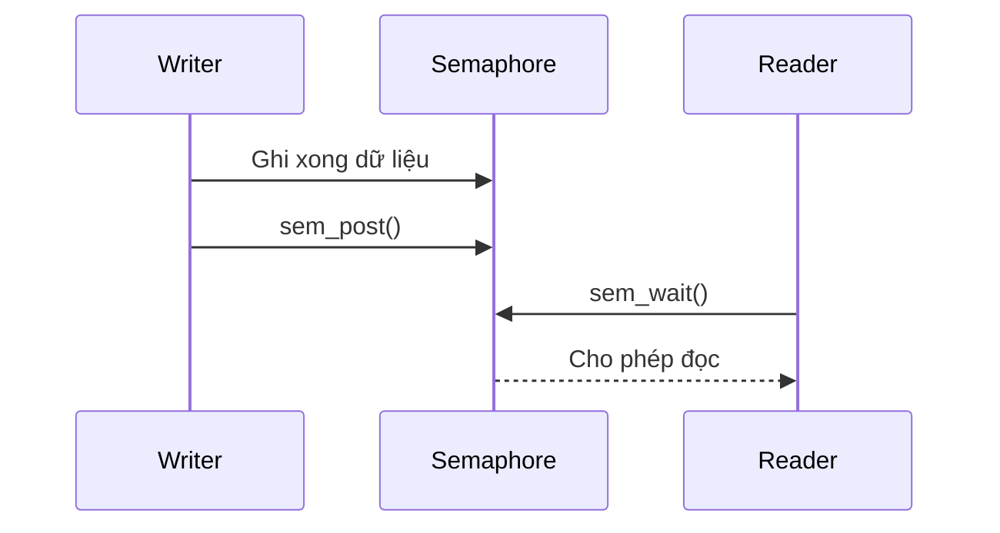
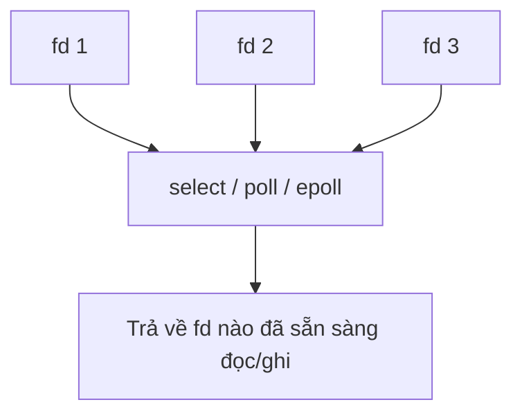
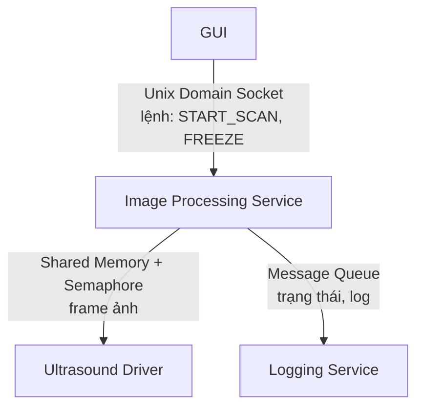
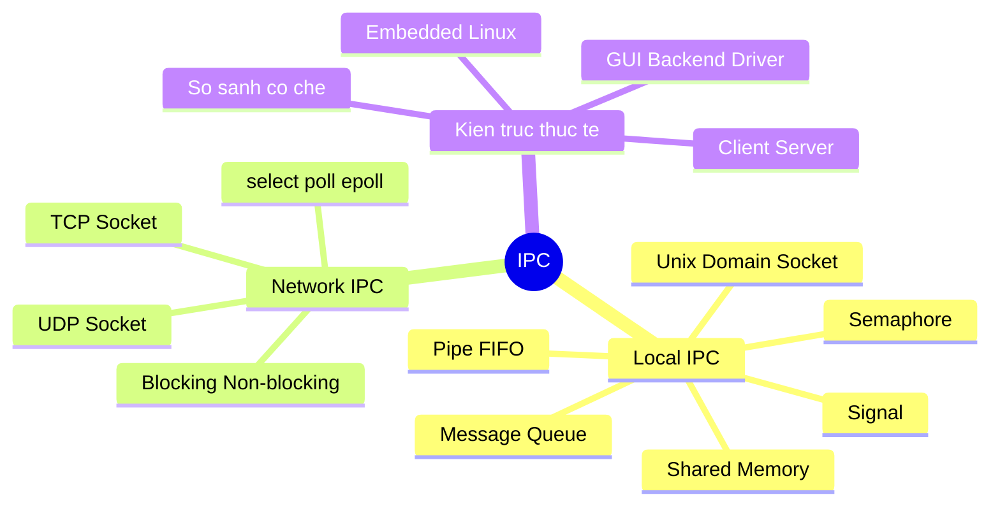

# Roadmap học IPC (Inter-Process Communication)

---

## Tổng quan

---

## Giai đoạn 0 — Nền tảng bắt buộc

Trước khi học bất kỳ cơ chế IPC nào, cần nắm chắc:

- Process là gì, Process có những gì (address space, heap, stack).
- Kernel Space vs User Space.
- File Descriptor là gì, vì hầu hết IPC trên Linux đều được truy cập thông qua fd.
- System Call hoạt động như thế nào (`syscall` chuyển từ User Space sang Kernel Space).

---

## Giai đoạn 1 — IPC cùng máy (Local IPC)

### Module 1: Pipe / FIFO

Cơ chế IPC đơn giản nhất — dữ liệu chảy một chiều qua một buffer trong kernel.

Nội dung cần học:
- `pipe()` — anonymous pipe, chỉ dùng giữa process cha–con.
- `mkfifo()` — named pipe, dùng được giữa các process không liên quan.
- Giới hạn: chỉ truyền byte stream, không giữ ranh giới message, thường chỉ một chiều.

### Module 2: Signal

Cơ chế thông báo sự kiện (không truyền dữ liệu lớn), kernel gửi một "ngắt" tới process.

Nội dung cần học: `signal()`, `sigaction()`, các signal phổ biến, signal-safe function, sự khác biệt giữa signal và interrupt phần cứng.

### Module 3: Message Queue

Kernel quản lý một hàng đợi message; sender/receiver không cần chạy đồng thời.

Nội dung cần học: `mq_open()`, `mq_send()`, `mq_receive()`, `mq_unlink()`, ưu điểm về priority message so với Pipe.

### Module 4: Shared Memory

Cơ chế IPC nhanh nhất — nhiều process cùng ánh xạ một vùng nhớ vật lý vào Virtual Address Space của mình.

Nội dung cần học: `shm_open()`, `ftruncate()`, `mmap()`, `munmap()`, `shm_unlink()`. Lưu ý: Shared Memory tự nó **không đồng bộ hóa** — cần kết hợp với Semaphore hoặc Mutex liên tiến trình.

### Module 5: Semaphore

Cơ chế đồng bộ hóa dùng để bảo vệ Shared Memory hoặc giới hạn số process truy cập tài nguyên.

Nội dung cần học: `sem_open()`, `sem_wait()`, `sem_post()`, phân biệt Binary Semaphore vs Counting Semaphore, so sánh với Mutex.

### Module 6: Unix Domain Socket

IPC mạnh nhất trên cùng máy — hỗ trợ cả Stream (TCP-like) và Datagram (UDP-like), full-duplex, có thể truyền cả file descriptor.

Nội dung cần học: `socket(AF_UNIX, ...)`, `bind()`, `listen()`, `accept()`, `connect()`, `send()`, `recv()`.

---

## Giai đoạn 2 — IPC qua mạng (Network IPC)

### Module 7: TCP Socket

Mở rộng Unix Domain Socket sang `AF_INET` — connection-oriented, reliable, ordered. API gần như giống hệt Unix Domain Socket.

### Module 8: UDP Socket

Connectionless, không đảm bảo thứ tự, nhanh — dùng cho streaming, telemetry, sensor data.

### Module 9: Blocking / Non-blocking I/O

Hiểu sự khác biệt giữa gọi hàm I/O bị chặn (blocking) và không chặn (non-blocking, trả về ngay kèm mã lỗi `EAGAIN`/`EWOULDBLOCK`).

### Module 10: select / poll / epoll

Cơ chế giám sát nhiều file descriptor cùng lúc — nền tảng để xây dựng server xử lý hàng nghìn kết nối đồng thời.

---

## Giai đoạn 3 — Kiến trúc & Ứng dụng thực tế

### Module 11: So sánh & lựa chọn cơ chế IPC

| Cơ chế | Tốc độ | Đồng bộ tự động? | Phạm vi | Phù hợp cho |
|---|---|---|---|---|
| Pipe / FIFO | Trung bình | Có (blocking read/write) | Cùng máy | Luồng dữ liệu đơn giản, một chiều |
| Signal | Rất nhanh | Không | Cùng máy | Thông báo sự kiện, không truyền data lớn |
| Message Queue | Trung bình | Có (queue) | Cùng máy | Command/event có cấu trúc, có priority |
| Shared Memory | Rất nhanh | Không (cần Semaphore) | Cùng máy | Dữ liệu lớn, tần suất cao (frame ảnh, buffer) |
| Semaphore | — | — (là công cụ đồng bộ) | Cùng máy | Bảo vệ Shared Memory, giới hạn tài nguyên |
| Unix Domain Socket | Nhanh | Có (connection) | Cùng máy | IPC command/control, truyền fd |
| TCP Socket | Chậm hơn (qua mạng) | Có (connection) | Cùng máy hoặc nhiều máy | Giao tiếp client-server, cần độ tin cậy |
| UDP Socket | Nhanh (qua mạng) | Không | Cùng máy hoặc nhiều máy | Streaming, real-time, chấp nhận mất gói |

### Module 12: Kiến trúc IPC thực tế

Ví dụ kiến trúc trong một hệ thống nhúng (máy siêu âm):

Nguyên tắc thiết kế:
- **Signal/Message Queue** cho lệnh điều khiển ngắn.
- **Shared Memory + Semaphore** cho dữ liệu lớn, tần suất cao (ảnh, audio buffer).
- **Socket** khi cần giao tiếp qua mạng hoặc muốn kiến trúc client-server rõ ràng, dễ mở rộng.

---

## Mindmap tổng kết

---

## Gợi ý cách học

1. Học từng module theo thứ tự — mỗi module đều nên có **code demo giữa 2 process thật** (không chỉ đọc lý thuyết).
2. Sau mỗi cơ chế, tự trả lời: *"Dữ liệu đi qua đâu? Ai giữ buffer? Cần đồng bộ hóa không?"*
3. Làm một dự án nhỏ tổng hợp nhiều IPC (ví dụ: GUI ↔ Backend qua Socket, Backend ↔ Worker qua Shared Memory) để thấy cách chúng phối hợp trong kiến trúc thực tế.
4. Khi phỏng vấn, chuẩn bị so sánh được các cơ chế theo: tốc độ, độ phức tạp, có cần đồng bộ hóa không, và trường hợp sử dụng phù hợp.