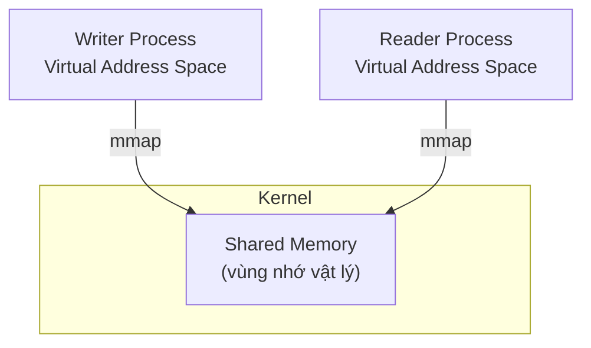
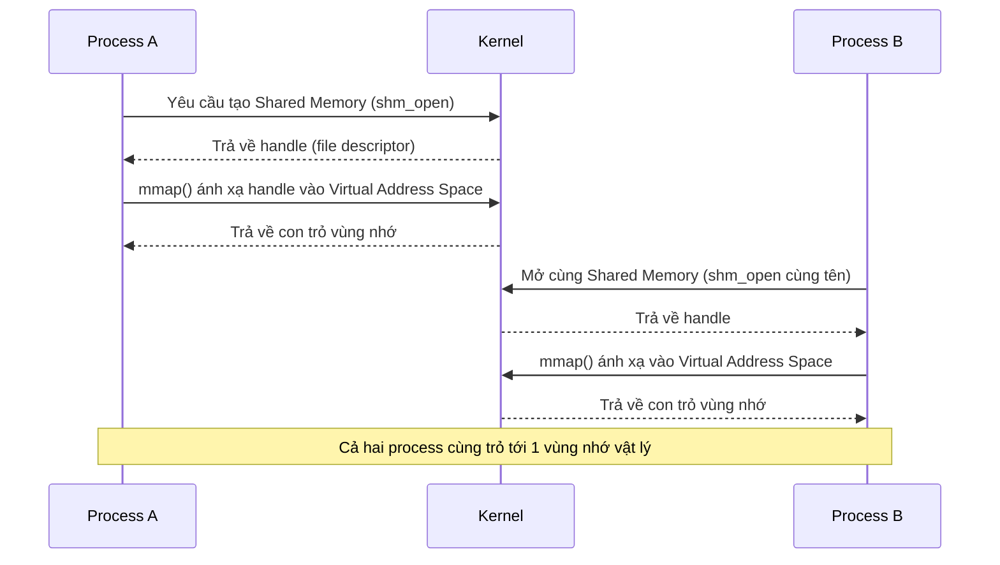
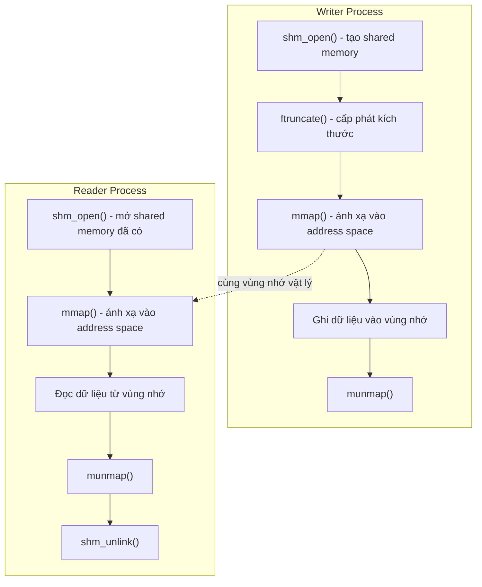

# Shared Memory hoạt động như thế nào?

Kernel tạo ra một vùng nhớ vật lý dùng chung, sau đó **ánh xạ (map)** vùng nhớ này vào **Virtual Address Space** của từng process thông qua `mmap()`. Nhờ vậy, nhiều process có thể cùng đọc/ghi trực tiếp lên cùng một vùng nhớ vật lý mà không cần copy dữ liệu qua kernel như pipe hay message queue.



Vì cả hai process cùng trỏ tới **một** vùng nhớ vật lý, nên đây là cơ chế IPC nhanh nhất: không có bước copy dữ liệu qua lại giữa các process — khác với pipe hoặc message queue, nơi dữ liệu phải được kernel sao chép giữa các buffer.

---

## Luồng hoạt động



**Bước 1:** Process A yêu cầu Kernel tạo Shared Memory (thông qua `shm_open()`).

**Bước 2:** Kernel trả về một **handle** (thực chất là một file descriptor, vì POSIX Shared Memory được quản lý dưới dạng file ảo trong `/dev/shm`).

**Bước 3:** Process gọi `mmap()` để ánh xạ handle đó vào Virtual Address Space của chính nó — từ đây process có thể đọc/ghi vùng nhớ như một con trỏ bình thường.

**Bước 4:** Process khác mở **cùng tên** Shared Memory, cũng gọi `mmap()`, và nhận được con trỏ trỏ tới cùng vùng nhớ vật lý.

---

## POSIX Shared Memory giữa 2 process

**Mục tiêu:**
- Writer Process tạo Shared Memory và ghi dữ liệu.
- Reader Process mở cùng Shared Memory và đọc dữ liệu.

> Ví dụ này **chưa sử dụng Semaphore**, để thấy rõ cơ chế hoạt động thuần của Shared Memory trước. Semaphore sẽ được bổ sung ở bài tiếp theo để đồng bộ hóa việc đọc/ghi (tránh race condition khi Reader đọc trước khi Writer ghi xong).

### Sơ đồ luồng code



### Writer Process

```cpp
#include <fcntl.h>
#include <sys/mman.h>
#include <unistd.h>
#include <cstring>
#include <cstdio>

#define SHM_NAME "/my_shared_memory"
#define SHM_SIZE 1024

int main()
{
    // 1. Tạo shared memory
    int fd = shm_open(SHM_NAME, O_CREAT | O_RDWR, 0666);
    if (fd == -1) {
        perror("shm_open");
        return 1;
    }

    // 2. Cấp phát kích thước cho vùng nhớ
    if (ftruncate(fd, SHM_SIZE) == -1) {
        perror("ftruncate");
        return 1;
    }

    // 3. Ánh xạ vào Virtual Address Space
    void* ptr = mmap(nullptr, SHM_SIZE, PROT_READ | PROT_WRITE,
                      MAP_SHARED, fd, 0);
    if (ptr == MAP_FAILED) {
        perror("mmap");
        return 1;
    }

    // 4. Ghi dữ liệu
    const char* message = "Hello from Writer Process";
    memcpy(ptr, message, strlen(message) + 1);

    printf("Writer da ghi: %s\n", message);

    // 5. Dọn dẹp (không unlink ở đây, để Reader còn đọc được)
    munmap(ptr, SHM_SIZE);
    close(fd);

    return 0;
}
```

### Reader Process

```cpp
#include <fcntl.h>
#include <sys/mman.h>
#include <unistd.h>
#include <cstdio>

#define SHM_NAME "/my_shared_memory"
#define SHM_SIZE 1024

int main()
{
    // 1. Mở shared memory đã tồn tại (không tạo mới)
    int fd = shm_open(SHM_NAME, O_RDONLY, 0666);
    if (fd == -1) {
        perror("shm_open");
        return 1;
    }

    // 2. Ánh xạ vào Virtual Address Space
    void* ptr = mmap(nullptr, SHM_SIZE, PROT_READ,
                      MAP_SHARED, fd, 0);
    if (ptr == MAP_FAILED) {
        perror("mmap");
        return 1;
    }

    // 3. Đọc dữ liệu
    printf("Reader doc duoc: %s\n", (char*)ptr);

    // 4. Dọn dẹp
    munmap(ptr, SHM_SIZE);
    close(fd);

    // 5. Xóa shared memory khỏi hệ thống
    shm_unlink(SHM_NAME);

    return 0;
}
```

> **Vấn đề chưa xử lý:** nếu Reader chạy trước khi Writer ghi xong dữ liệu, Reader có thể đọc dữ liệu rác hoặc chưa được cập nhật — đây chính là **race condition**. Bài tiếp theo sẽ dùng `sem_open()` (POSIX Semaphore) để đồng bộ: Reader chỉ đọc sau khi Writer báo hiệu đã ghi xong.

---

## Thư viện cần dùng

| API | Header |
|---|---|
| `shm_open()` | `<fcntl.h>` |
| `ftruncate()` | `<unistd.h>` |
| `mmap()` | `<sys/mman.h>` |
| `munmap()` | `<sys/mman.h>` |
| `shm_unlink()` | `<fcntl.h>` |
| `close()` | `<unistd.h>` |
| `perror()` | `<cstdio>` |
| `strlen()`, `memcpy()` | `<cstring>` |