# Roadmap Socket

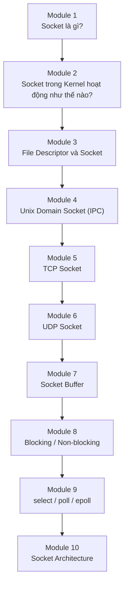

---

## 1. Socket là gì?

Socket thực chất là:

> **Một endpoint (điểm cuối) của một kênh giao tiếp.**

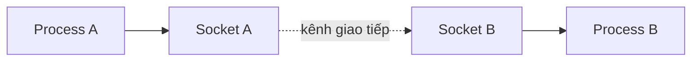

Hai process **không giao tiếp trực tiếp**. Mỗi process chỉ làm việc với socket của mình. Kernel chịu trách nhiệm chuyển dữ liệu giữa hai socket.

---

## Socket khác Shared Memory thế nào?

### Shared Memory

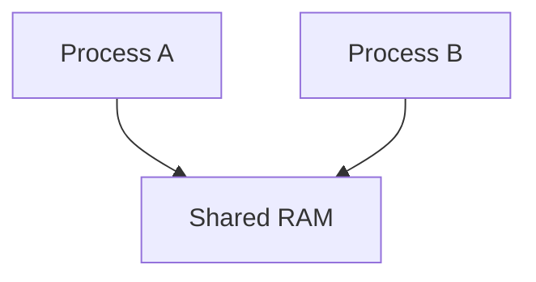

Hai process cùng nhìn vào một vùng RAM.

### Socket

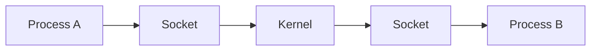

Kernel luôn đứng giữa. Đó là sự khác biệt lớn nhất.

---

## Socket khác Message Queue thế nào?

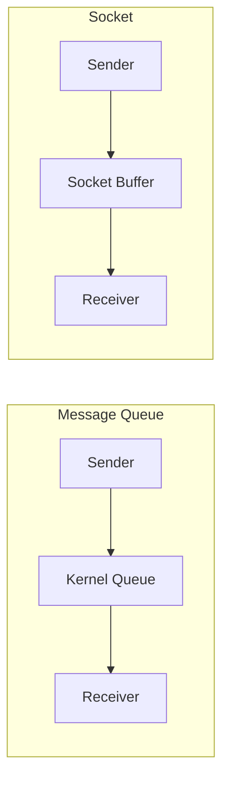

Thoạt nhìn giống nhau, nhưng khác ở bản chất:

| Message Queue | Socket |
|---|---|
| Queue | Connection |

Socket tạo ra một **kênh giao tiếp liên tục**, trong khi Message Queue chỉ truyền từng message rời rạc.

---

## Tại sao phải có Socket?

Giả sử:

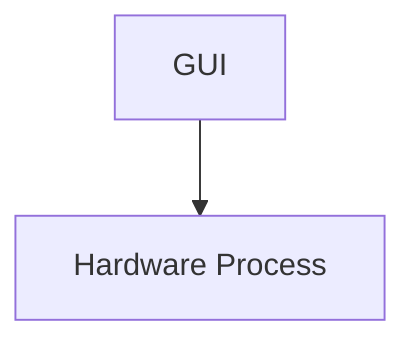

Có thể dùng **Shared Memory** được.

Nhưng nếu:

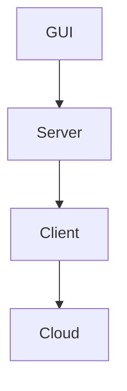

thì sao? Shared Memory không thể. Message Queue cũng không. **Socket thì được.**

Socket được thiết kế để:

- IPC trên cùng máy.
- IPC giữa nhiều máy.

API gần như giống nhau.

---

## 2. Socket nằm ở đâu trong Kernel?

Đây là phần quan trọng nhất.

Nhiều người nghĩ socket kết nối trực tiếp giữa hai process — **không đúng**. Thực tế Kernel tạo ra một **object**:

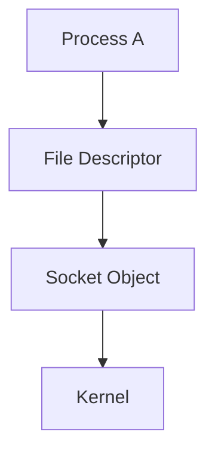

Socket Object nằm hoàn toàn trong Kernel Space.

---

## Kiến trúc trong Kernel

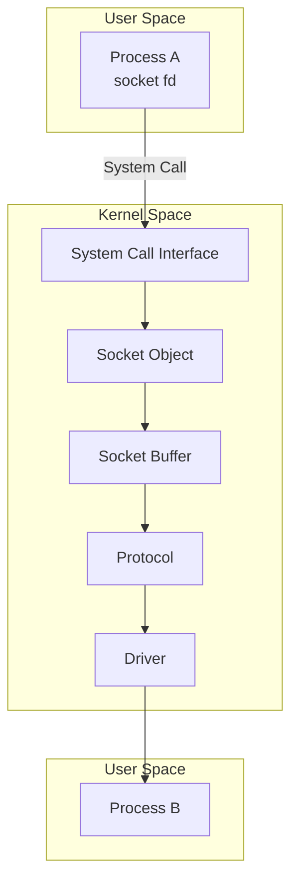

---

## Kernel tạo gì khi gọi socket()?

Giả sử:

```cpp
socket(AF_UNIX, SOCK_STREAM, 0);
```

Kernel tạo một **Socket Object** chứa:

- Domain
- Type
- Protocol
- State
- Receive Buffer
- Send Buffer
- File Operations
- Reference Count
- Credential
- ...

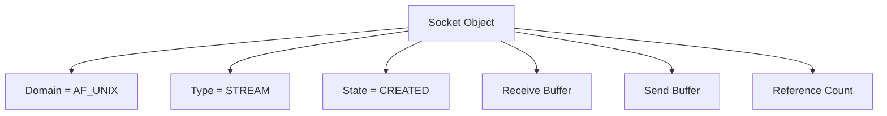

---

## Socket Object nằm ở đâu?

Hoàn toàn trong **Kernel Heap**. Process chỉ giữ **File Descriptor**.

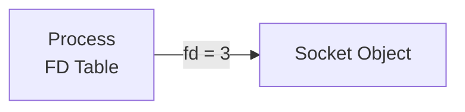

Giống Shared Memory: `fd → Kernel Object`.

---

## Socket Buffer

Đây là phần cực kỳ quan trọng. Socket luôn có **Send Buffer** và **Receive Buffer**.

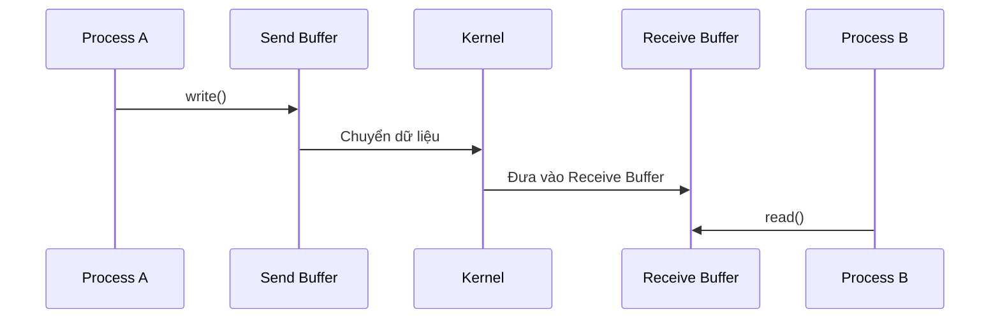

Đây chính là lý do `write()` không phải lúc nào cũng gửi dữ liệu ngay lập tức — dữ liệu được đưa vào Send Buffer trước, kernel xử lý và chuyển đi sau.

---

## Socket có những loại nào?

Có hai cách phân loại: theo **Domain** và theo **Type**.

### Theo Domain

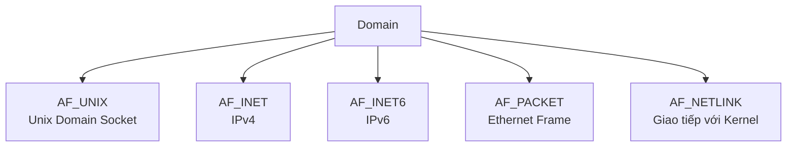

| Domain | Mô tả | Ví dụ sử dụng |
|---|---|---|
| `AF_UNIX` | Chỉ dùng trên cùng máy (GUI ↔ Backend) | IPC nội bộ |
| `AF_INET` | IPv4 (vd: `192.168.1.100`) | Giao tiếp mạng |
| `AF_INET6` | IPv6 | Giao tiếp mạng |
| `AF_PACKET` | Làm việc trực tiếp với Ethernet Frame | Wireshark, tcpdump |
| `AF_NETLINK` | Giao tiếp với Kernel | iproute2, udev, NetworkManager |

### Theo Type

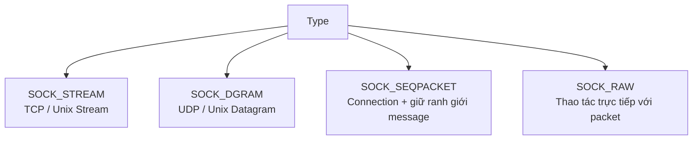

| Type | Đặc điểm | Ví dụ |
|---|---|---|
| `SOCK_STREAM` | Connection, Reliable, Ordered | SSH, HTTP, HTTPS |
| `SOCK_DGRAM` | Không connection, không đảm bảo, nhanh | DNS, Video Streaming, VoIP |
| `SOCK_SEQPACKET` | Giữ nguyên ranh giới message, có kết nối | Một số hệ thống IPC nội bộ |
| `SOCK_RAW` | Socket thô, thao tác trực tiếp với packet | ping, tcpdump, Wireshark |

---

## Kiến trúc tổng thể

```mermaid
graph TD
    subgraph US1["User Space"]
        PA["Process A<br/>FD = 3"]
    end

    PA -->|socket()| SC["System Call"]

    subgraph KS["Kernel Space"]
        SC --> SOBJ["Socket Object"]
        SOBJ --> SB["Send Buffer"]
        SB --> PROTO["Protocol"]
        PROTO --> RB["Receive Buffer"]
    end

    subgraph US2["User Space"]
        PB["Process B<br/>FD = 5"]
    end

    RB --> PB
```

---

## Trong Embedded Linux người ta dùng loại nào?

Nếu làm **Embedded Linux** sẽ gặp:

| Loại | Mục đích |
|---|---|
| **Unix Domain Socket** (`AF_UNIX + SOCK_STREAM`) | IPC giữa các process trên cùng máy |
| **TCP Socket** (`AF_INET + SOCK_STREAM`) | Giao tiếp với server hoặc thiết bị khác |
| **UDP Socket** (`AF_INET + SOCK_DGRAM`) | Streaming, telemetry, sensor |

Ví dụ trong máy siêu âm:

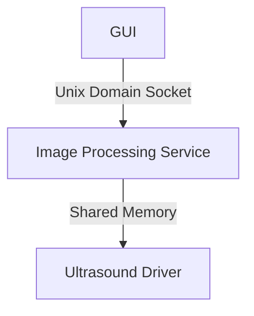

Ở đây:

- **Socket** truyền lệnh như `START_SCAN`, `FREEZE`, `SAVE_IMAGE`.
- **Shared Memory** truyền frame ảnh siêu âm.
- Đây là một kiến trúc rất phổ biến trong các hệ thống nhúng hiệu năng cao.

---

## Lộ trình tiếp theo

Sau khi nắm vững hai module đầu tiên, nên tiếp tục với:

> **Unix Domain Socket (`AF_UNIX`)**

Đây là IPC thuần túy, rất giống Shared Memory và Message Queue nhưng mạnh hơn nhiều. Sau khi hiểu rõ Unix Domain Socket, việc chuyển sang TCP/UDP sẽ rất tự nhiên vì API gần như giống hệt nhau, chỉ khác `domain` và cách `bind()` địa chỉ.

---

## Socket - Mindmap tổng quan (Module 1 & Module 2)

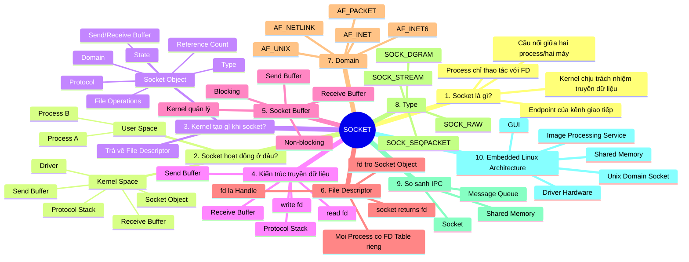

---

## Kiến thức cốt lõi cần nhớ

### Socket = Endpoint

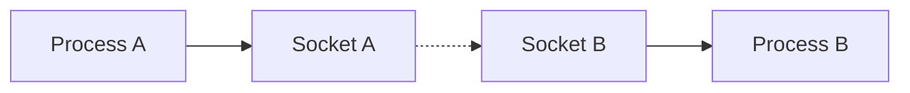

### Socket Object nằm trong Kernel

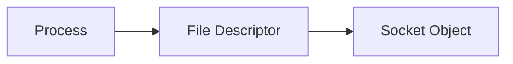

### Dữ liệu luôn đi qua Kernel

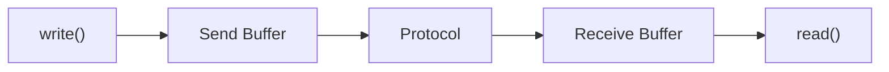

### Socket khác Shared Memory

```mermaid
graph TD
    subgraph SM["Shared Memory"]
        A1["Process A"] --> RAM["RAM"]
        B1["Process B"] --> RAM
    end

    subgraph SK["Socket"]
        A2["Process A"] --> K["Kernel"] --> B2["Process B"]
    end
```

### Socket khác Message Queue

```mermaid
graph LR
    subgraph MQ["Message Queue"]
        S1["Sender"] --> Q1["Kernel Queue"] --> R1["Receiver"]
    end

    subgraph SC["Socket"]
        S2["Process A"] --> C2["Connection"] --> R2["Process B"]
    end
```

Message Queue truyền từng **Message**. Socket tạo một **kênh giao tiếp liên tục (Connection)**.

---

## Những API sẽ học ở Module tiếp theo (Unix Domain Socket)

```mermaid
graph LR
    A["socket()"] --> B["bind()"] --> C["listen()"] --> D["accept()"]
    E["connect()"] --> F["send()"] --> G["recv()"] --> H["close()"]
```

Đây là bộ API nền tảng của Socket. Khi đã hiểu chúng với **Unix Domain Socket**, bạn gần như đã nắm được khoảng **90% API của TCP Socket**, vì sự khác biệt chủ yếu nằm ở **Address Family** (`AF_UNIX` ↔ `AF_INET`) và cách biểu diễn địa chỉ.

### Ý nghĩa từng API

| API | Vai trò |
|---|---|
| `socket()` | Tạo socket object trong kernel, trả về file descriptor |
| `bind()` | Gắn socket server với một địa chỉ, ví dụ `/tmp/demo_unix_socket` |
| `listen()` | Chuyển socket sang trạng thái chờ kết nối |
| `accept()` | Chấp nhận một client mới |
| `connect()` | Client kết nối tới server |
| `send()` | Gửi dữ liệu |
| `recv()` | Nhận dữ liệu |
| `close()` | Đóng file descriptor |
| `unlink()` | Xóa socket file trong filesystem |